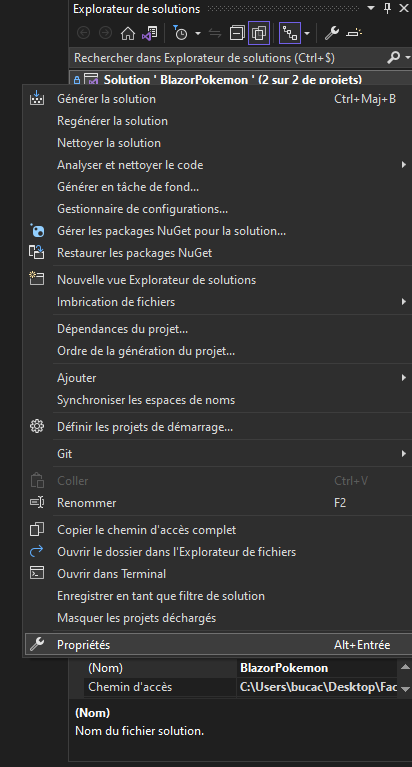

# Projet de création d'un inventaire en Blazor

Ce projet avait pour but de créer un inventaire Pokemon à l'aide du framework Blazor et ce afin de nous faire découvrir ce dernier.

## Lancement du projet

Etant donné que le projet n'est constitué que de la branche `master`, c'est celle-ci que nous allons utiliser.

Une fois le dépôt cloné, il faut lancer les 2 projets qui y sont présent.

Pour cela, lancer la solution avec Visual Studio : `BlazorPokemon.sln`

Ensuite, on va définir les projets de démarrage :

    1. Clique droit sur la solution
    2. Définir les projets de démarrage...

    
    3. On sélectionne : Plusieurs projets de démarrage
    4. On met les deux projet sur : Démarrer

    5. On démarre le projet global
    

Auteurs : Othmane Benjelloun et Bruno Da Costa Cunha
